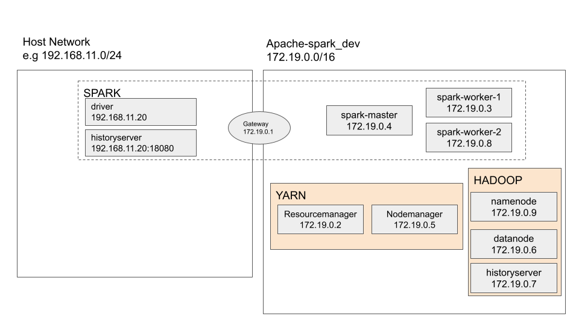
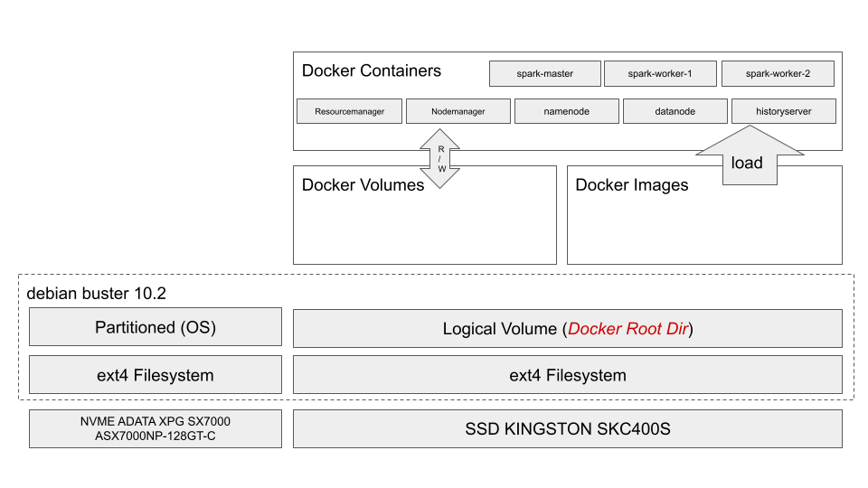

# Overview

Project to test spark code.

# Design

## Network

Below will be image of network architecture when containers are deployed using docker-compose.
Ip address might vary depending on your environment.



# Deploy

## Pre Requisite

docker  
docker-compose

## Build platform

Docker compose is based on 2 repositories.

https://github.com/bitnami/bitnami-docker-spark  
https://github.com/big-data-europe/docker-spark

```
docker-compose up -d
```

## Deploy
cd $APP_DIR
make deploy NAME=NAME_OF_APP

## History server
```
start-history-server.sh --properties-file spark-history-server.conf
```

## How to make dependencies
```
pip install -t deps MODULES
cd deps
zip deps.zip .
```

# Spark Benchmark

I have my docker installed as below filesystem condition.


Below will be sample result for spark benchmarking.

|App Name|Description|Executor Cpus|Executore Memory|Duration|
|-----|--------|-------------|----------------|--------|
|s3connect|Upload PNG imgs from hdfs to S3|1|1G||
